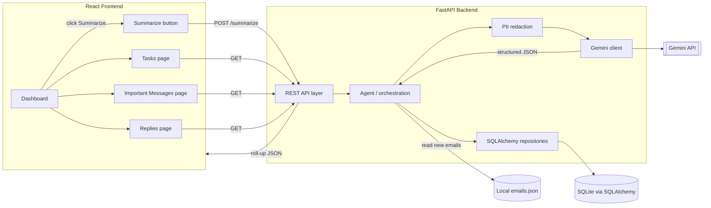
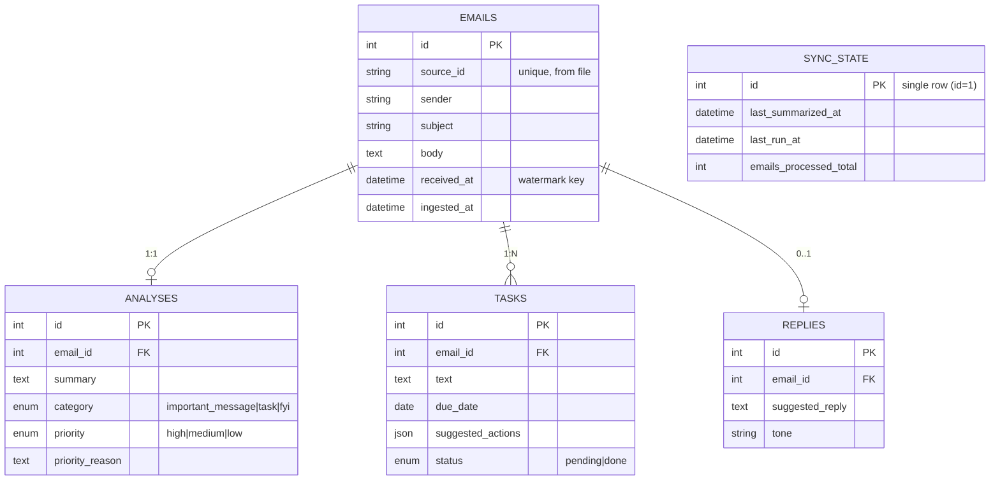

# Inbox Copilot — System Design

AI email assistant for a 3-hour hackathon. Backend: **FastAPI + SQLAlchemy (SQLite)**. Frontend: **React**. LLM: **Gemini, called from the backend** (never the browser — keeps the key safe and gives PII redaction a place to live).

No login/auth — this is a single-user local tool. The app opens straight to the Dashboard and processes emails from a local file (`data/emails.json`) on disk.

---

## 0. Repository structure (everyone sets this up identically)

Single monorepo, `backend/` and `frontend/` side by side. Clone this, agree on it in the first 5 minutes, then each person mostly lives inside their own folders — that's what keeps merges clean when four people push in parallel.

```
inbox-copilot/
├── README.md
├── .gitignore                    # ignore .env, *.db, node_modules, __pycache__
├── .env.example                  # documents required vars, no secrets
├── data/
│   └── emails.json               # the local demo inbox (shared source of truth)
├── docs/
│   ├── email_assistant_design.md # this file
│   └── diagrams/                 # exported architecture / ER images for slides
│
├── backend/                      # ---- Person 1 (+ Person 3 for security) ----
│   ├── requirements.txt
│   ├── .env.example              # GEMINI_API_KEY=, DATABASE_URL=, EMAIL_FILE=
│   └── app/
│       ├── __init__.py
│       ├── main.py               # FastAPI app, CORS, startup create_all()
│       ├── config.py             # settings + paths (reads .env)
│       ├── database.py           # engine, SessionLocal, Base
│       ├── models.py             # SQLAlchemy models  (see §4)
│       ├── schemas.py            # Pydantic request/response shapes
│       ├── security.py           # redact_pii()  (Person 3)
│       ├── crud.py               # insert_email, save_task, save_reply, watermark
│       ├── routers/
│       │   ├── summarize.py      # POST /summarize
│       │   ├── dashboard.py      # GET  /dashboard
│       │   ├── tasks.py          # GET/PATCH /tasks
│       │   ├── messages.py       # GET  /messages
│       │   └── replies.py        # GET /replies, POST /replies/{id}/regenerate
│       └── services/
│           ├── agent.py          # orchestration + watermark logic  (see §6)
│           ├── gemini_client.py  # analyze_email()  (see §5)
│           ├── ingest.py         # load_emails_from_file + dedup
│           └── rollup.py         # build_rollup()
│   └── tests/
│       └── test_edge_cases.py    # spam / no-deadline / multi-task  (Person 4)
│
└── frontend/                     # ---- Person 2 (+ Person 3 for ReplyEditor) ----
    ├── package.json
    ├── .env.example              # VITE_API_BASE_URL=
    ├── index.html
    ├── vite.config.js
    └── src/
        ├── main.jsx
        ├── App.jsx               # router, Dashboard is the default/entry route
        ├── api/client.js         # fetch wrapper, base URL, error handling
        ├── pages/
        │   ├── Dashboard.jsx     # today/tomorrow tasks + counts + last summarized
        │   ├── Tasks.jsx
        │   ├── Messages.jsx      # cards showing priority_reason
        │   └── Replies.jsx
        ├── components/
        │   ├── SummarizeButton.jsx
        │   ├── LoadingState.jsx  # "Agent reading N emails…"
        │   ├── TaskCard.jsx
        │   ├── MessageCard.jsx
        │   └── ReplyEditor.jsx   # tone toggle + regenerate  (Person 3)
        └── mocks/
            └── summarizeResponse.json  # lets FE build before backend is ready
```

**Rules that prevent merge hell:**

- One shared file everyone touches: `data/emails.json`. Agree its contents once and freeze it — if you must add demo emails later, one person owns the edit.
- `models.py` and the Gemini schema in `gemini_client.py` are the contract. Person 1 owns both; if either changes, announce it and everyone updates mocks together.
- Frontend works against `src/mocks/summarizeResponse.json` from minute one, so Person 2 is never blocked waiting on the backend.
- Never commit `.env` or `*.db` — only the `.env.example` templates. Put both in `.gitignore` before the first push.
- Branch per person (`feat/backend`, `feat/frontend`, `feat/security`, `feat/docs`), merge to `main` at the 1:30 integration checkpoint.

---

## 1. Core behavior

On **Summarize**, the agent processes each email and produces one classification plus extractions:

- **`important_message`** → generate a **suggested reply** (with a tone).
- **`task`** → generate one or more **tasks**, each with a **due date** and **suggested actions**.
- **`fyi`** → summarize only; no reply, no task. (Keeps the inbox from being all-message/all-task.)

Every email also gets a one-line summary, a priority, and a **priority reason** (the explainability differentiator).

### Incremental processing (the "last summarized" watermark)

The system stores a **watermark** = the timestamp of the newest email processed so far (`last_summarized_at`). Each Summarize run only processes emails whose `received_at` is **strictly greater** than the watermark, then advances the watermark to the newest email it just processed.

- **First run:** watermark is `NULL` → process everything in the file.
- **Later runs:** process only emails that arrived after the last run.
- **Demo story:** summarize → append newer-timestamped emails to the file → summarize again → only the new ones get processed. Clean, visible, cheap to show.

Watermark = `max(received_at)` of processed emails (not "now"), because the emails come from a local file with their own timestamps. Using `>` on the max means same-timestamp emails all process in one run and none reprocess next run. A `source_id` uniqueness check is a second guard against duplicates.

---

## 2. Architecture



Clean layer separation (API / agent / redaction / LLM / data) is what earns the architecture and security rubric points. The Gemini call sitting **behind** redaction in the backend is the single most important line in this diagram.

---

## 3. Data model (ER diagram)



An email has exactly one analysis, zero-or-more tasks, and zero-or-one suggested reply. This normalization handles the case where one email is *both* a question needing a reply and a to-do — you're not forced to pick.

---

## 4. SQLAlchemy models

Modern SQLAlchemy 2.0 style (`DeclarativeBase` + `Mapped`). Drop into `models.py`.

```python
from __future__ import annotations
from datetime import datetime, date
from enum import Enum as PyEnum
from typing import Optional
from sqlalchemy import (
    String, Text, DateTime, Date, ForeignKey, Enum, JSON, func
)
from sqlalchemy.orm import (
    DeclarativeBase, Mapped, mapped_column, relationship
)


class Base(DeclarativeBase):
    pass


# ---- enums -----------------------------------------------------------
class Category(str, PyEnum):
    IMPORTANT_MESSAGE = "important_message"
    TASK = "task"
    FYI = "fyi"


class Priority(str, PyEnum):
    HIGH = "high"
    MEDIUM = "medium"
    LOW = "low"


class TaskStatus(str, PyEnum):
    PENDING = "pending"
    DONE = "done"


# ---- tables ----------------------------------------------------------
class SyncState(Base):
    """Single row (id=1). Holds the incremental watermark for the local inbox."""
    __tablename__ = "sync_state"
    id: Mapped[int] = mapped_column(primary_key=True)
    last_summarized_at: Mapped[Optional[datetime]] = mapped_column(DateTime, nullable=True)
    last_run_at: Mapped[Optional[datetime]] = mapped_column(DateTime, nullable=True)
    emails_processed_total: Mapped[int] = mapped_column(default=0)


class Email(Base):
    __tablename__ = "emails"
    id: Mapped[int] = mapped_column(primary_key=True)
    source_id: Mapped[str] = mapped_column(String(120), unique=True, index=True)
    sender: Mapped[str] = mapped_column(String(255))
    subject: Mapped[str] = mapped_column(String(500))
    body: Mapped[str] = mapped_column(Text)
    received_at: Mapped[datetime] = mapped_column(DateTime, index=True)  # watermark key
    ingested_at: Mapped[datetime] = mapped_column(DateTime, server_default=func.now())

    analysis: Mapped[Optional["Analysis"]] = relationship(
        back_populates="email", uselist=False, cascade="all, delete-orphan"
    )
    tasks: Mapped[list["Task"]] = relationship(
        back_populates="email", cascade="all, delete-orphan"
    )
    reply: Mapped[Optional["Reply"]] = relationship(
        back_populates="email", uselist=False, cascade="all, delete-orphan"
    )


class Analysis(Base):
    __tablename__ = "analyses"
    id: Mapped[int] = mapped_column(primary_key=True)
    email_id: Mapped[int] = mapped_column(ForeignKey("emails.id"), unique=True)
    summary: Mapped[str] = mapped_column(Text)
    category: Mapped[Category] = mapped_column(Enum(Category), index=True)
    priority: Mapped[Priority] = mapped_column(Enum(Priority))
    priority_reason: Mapped[str] = mapped_column(Text)
    created_at: Mapped[datetime] = mapped_column(DateTime, server_default=func.now())

    email: Mapped["Email"] = relationship(back_populates="analysis")


class Task(Base):
    __tablename__ = "tasks"
    id: Mapped[int] = mapped_column(primary_key=True)
    email_id: Mapped[int] = mapped_column(ForeignKey("emails.id"), index=True)
    text: Mapped[str] = mapped_column(Text)
    due_date: Mapped[Optional[date]] = mapped_column(Date, nullable=True)
    suggested_actions: Mapped[Optional[list]] = mapped_column(JSON, nullable=True)  # list[str]
    status: Mapped[TaskStatus] = mapped_column(Enum(TaskStatus), default=TaskStatus.PENDING)
    created_at: Mapped[datetime] = mapped_column(DateTime, server_default=func.now())

    email: Mapped["Email"] = relationship(back_populates="tasks")


class Reply(Base):
    __tablename__ = "replies"
    id: Mapped[int] = mapped_column(primary_key=True)
    email_id: Mapped[int] = mapped_column(ForeignKey("emails.id"), unique=True)
    suggested_reply: Mapped[str] = mapped_column(Text)
    tone: Mapped[str] = mapped_column(String(40), default="friendly")
    created_at: Mapped[datetime] = mapped_column(DateTime, server_default=func.now())

    email: Mapped["Email"] = relationship(back_populates="reply")
```

> Note: SQLite doesn't natively enforce `Enum`/`JSON`, but SQLAlchemy handles the (de)serialization for you, so the Python side stays clean. Create tables once at startup with `Base.metadata.create_all(engine)`.

---

## 5. Gemini output contract

One structured call per email. Force JSON with a response schema so you never parse free text.

```python
# gemini_client.py (sketch)
import google.generativeai as genai

RESPONSE_SCHEMA = {
    "type": "object",
    "properties": {
        "summary": {"type": "string"},
        "category": {"type": "string", "enum": ["important_message", "task", "fyi"]},
        "priority": {"type": "string", "enum": ["high", "medium", "low"]},
        "priority_reason": {"type": "string"},
        "suggested_reply": {"type": "string"},   # "" if not a message
        "tone": {"type": "string"},              # "" if no reply
        "tasks": {
            "type": "array",
            "items": {
                "type": "object",
                "properties": {
                    "text": {"type": "string"},
                    "due_date": {"type": "string"},          # ISO date or ""
                    "suggested_actions": {
                        "type": "array", "items": {"type": "string"}
                    },
                },
                "required": ["text"],
            },
        },
    },
    "required": ["summary", "category", "priority", "priority_reason", "tasks"],
}

SYSTEM = """You are an inbox triage agent. Classify each email as exactly one of:
- important_message: needs a human reply -> write a suggested_reply and pick a tone.
- task: contains an action the user must do -> fill tasks[] with text, due_date, suggested_actions.
- fyi: informational only -> summary only, empty reply, empty tasks.
Rules:
- If there is no deadline, leave due_date as "". NEVER invent a date.
- priority_reason must cite the concrete signal (who is asking, the deadline, the ask).
- Interpret relative dates ("by Thursday") against the email's received_at, which is provided.
Return ONLY JSON matching the schema."""

def analyze_email(subject, body, received_at):
    model = genai.GenerativeModel(
        "gemini-1.5-flash",
        generation_config={
            "response_mime_type": "application/json",
            "response_schema": RESPONSE_SCHEMA,
        },
        system_instruction=SYSTEM,
    )
    prompt = f"received_at: {received_at.isoformat()}\nSubject: {subject}\n\n{body}"
    return model.generate_content(prompt).text  # already valid JSON
```

The three rules (no invented dates, cite the reason, resolve relative dates against `received_at`) are exactly what the prompt-engineering rubric line rewards — they show you understand model limitations.

---

## 6. The `/summarize` flow

```mermaid
sequenceDiagram
    participant U as User (React)
    participant API as FastAPI
    participant A as Agent
    participant F as emails.json
    participant G as Gemini
    participant DB as SQLite

    U->>API: POST /summarize
    API->>A: run()
    A->>DB: read watermark (last_summarized_at)
    A->>F: load all emails
    A->>A: keep received_at > watermark, drop known source_ids
    loop each new email
        A->>A: redact PII (regex)
        A->>G: analyze_email(subject, body, received_at)
        G-->>A: structured JSON
        A->>DB: insert email + analysis (+ reply / tasks)
    end
    A->>DB: watermark = max(received_at); last_run_at = now
    A-->>API: roll-up
    API-->>U: {today, tomorrow, important, counts}
```

Pseudocode for the agent:

```python
def summarize():
    state = get_or_create_sync_state()   # singleton row, id=1
    watermark = state.last_summarized_at

    emails = load_emails_from_file(EMAIL_FILE)          # list[dict]
    new = [e for e in emails
           if (watermark is None or parse(e["received_at"]) > watermark)
           and not email_exists(e["source_id"])]

    processed, max_seen = 0, watermark
    for e in new:
        email = insert_email(e)
        clean = redact_pii(email.body)                 # emails, phones -> [REDACTED]
        result = json.loads(analyze_email(email.subject, clean, email.received_at))

        save_analysis(email, result)                   # summary, category, priority, reason
        if result["category"] == "important_message" and result.get("suggested_reply"):
            save_reply(email, result["suggested_reply"], result.get("tone", "friendly"))
        for t in result.get("tasks", []):
            save_task(email, t)                         # text, due_date, suggested_actions

        processed += 1
        max_seen = max(max_seen or email.received_at, email.received_at)

    state.last_summarized_at = max_seen or watermark
    state.last_run_at = datetime.utcnow()
    state.emails_processed_total += processed
    commit()
    return build_rollup()
```

Roll-up query for the dashboard:

```python
def build_rollup():
    today, tomorrow = date.today(), date.today() + timedelta(days=1)
    return {
        "last_summarized_at": get_sync_state().last_summarized_at,
        "todays_tasks":    tasks_where(due_date=today, status="pending"),
        "tomorrows_tasks": tasks_where(due_date=tomorrow, status="pending"),
        "important":       analyses_where(category="important_message"),
        "counts": {
            "messages": count(category="important_message"),
            "tasks":    count_tasks(status="pending"),
            "fyi":      count(category="fyi"),
        },
    }
```

---

## 7. API endpoints

| Method | Route | Purpose |
|---|---|---|
| POST | `/summarize` | Process only new emails, return dashboard roll-up |
| GET | `/dashboard` | Today/tomorrow tasks + important + counts + last_summarized_at |
| GET | `/tasks` | All tasks (filter by due/status) |
| GET | `/messages` | Important messages with priority_reason |
| GET | `/replies` | Emails with their suggested reply + tone |
| PATCH | `/tasks/{id}` | Mark task done / edit |
| POST | `/replies/{id}/regenerate` | Re-draft a reply with a chosen tone (bonus) |

---

## 8. Local email file format

`emails.json` — the whole demo lives here. Give emails a realistic spread of timestamps so the watermark demo works.

```json
[
  {
    "source_id": "e001",
    "sender": "priya.manager@acme.com",
    "subject": "Q3 report — need it Thursday",
    "body": "Can you send me the Q3 sales summary before Thursday's review? Call me at 555-0142 if blocked.",
    "received_at": "2026-08-11T09:15:00"
  },
  {
    "source_id": "e002",
    "sender": "newsletter@devweekly.com",
    "subject": "This week in AI",
    "body": "Top links for the week ...",
    "received_at": "2026-08-11T07:00:00"
  }
]
```

To demo incremental processing, append a couple of entries with `received_at` later than your first run and click Summarize again — only those get processed.

---

## 9. Rubric coverage (quick map)

| Category | Where it shows up |
|---|---|
| Data modeling | §3 ER diagram + §4 normalized SQLAlchemy models |
| Architecture / code flow | §2 layered diagram, §6 sequence diagram |
| Prompt / LLM | §5 schema-forced output + limitation rules |
| Security / PII | backend-side Gemini key + `redact_pii` before the LLM |
| Tech reasoning | Flash for latency, SQLite zero-config, JSON schema for reliability |
| Business value | incremental watermark = only-new-work = real time saved |

The watermark is worth calling out in the demo as a *product* decision, not just a feature: it means the assistant does no redundant work and no redundant LLM spend on re-reads.
